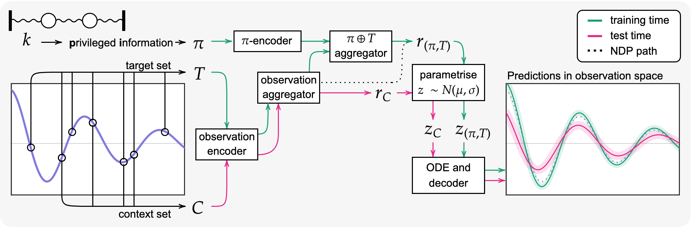

# Meta-learning using privileged information for dynamics

Official code for the workshop paper [Meta-learning using privileged information for dynamics](https://arxiv.org/abs/2104.14290) (ICLR workshops 2021).



## Abstract

Neural ODE Processes approach the problem of meta-learning for dynamics using a latent variable model, which permits a flexible aggregation of contextual information. This flexibility is inherited from the Neural Process framework and allows the model to aggregate sets of context observations of arbitrary size into a fixed-length representation. In the physical sciences, we often have access to structured knowledge in addition to raw observations of a system, such as the value of a conserved quantity or a description of an understood component. Taking advantage of the aggregation flexibility, we extend the Neural ODE Process model to use additional information within the Learning Using Privileged Information setting, and we validate our extension with experiments showing improved accuracy and calibration on simulated dynamics tasks.

```
@misc{
    day2021dynamics,
    title={Meta-learning using privileged information for dynamics},
    author={Ben Day and Alexander Norcliffe and Jacob Moss and Pietro Li{\`o}},
    year={2021},
    eprint={2104.14290},
    archivePrefix={arXiv},
    primaryClass={cs.LG}
}
```

This repository contains the code to run all of the experiments included in the paper. The colab notebook reproduces the varying-stiffness experiment for the LUPI-NDP and can be easily modified to use the NDP or run the varying-drag experiment.
